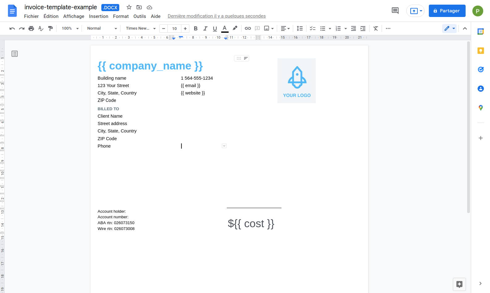
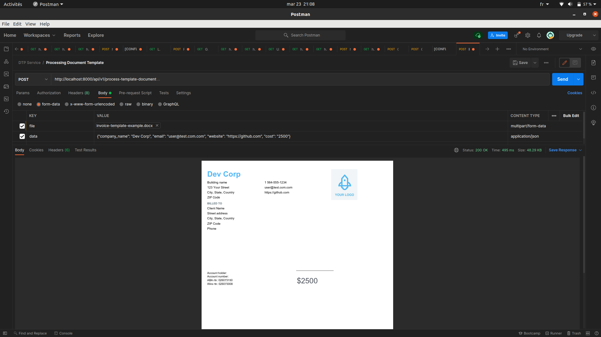
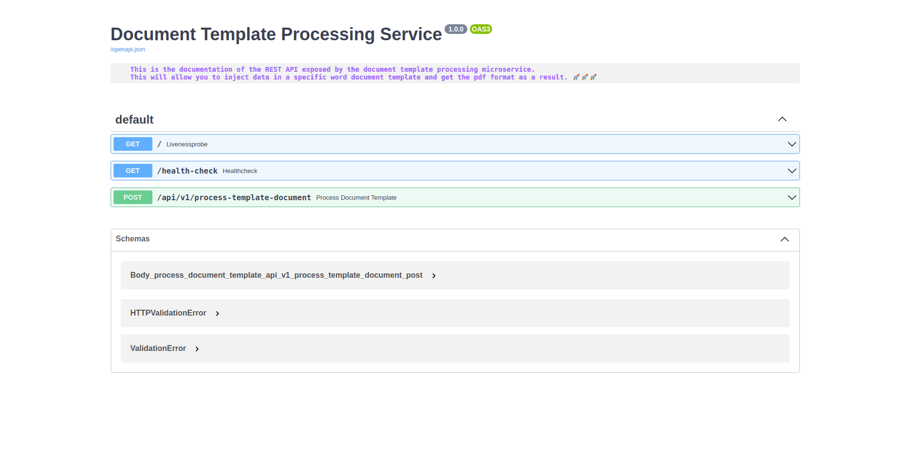

# 🚀 Document Template Processing Service 🚀

This is a simple and lightweight microservice that allow you to process your `Word` documents with a `templating system`, in order to hydrate it by injecting data or variables defined in it and get back its associated `PDF` result.

Feel free to checkout the [official docker image](https://hub.docker.com/r/papihack/document-template-processor) on my docker hub.

## Notes

For transforming the `docx` result to `PDF` you'll need have an instance of [Gotenberg](https://gotenberg.dev) up and running and provide its `ROOT URL` as an environment variable to the microservice.

## Installation

- First and foremost you'll need to have an instance of Gotenberg. You can easily have one by running the following docker command : 

        docker run --name gotenberg -d -p 3000:3000 gotenberg/gotenberg:7

- After this step done, you have the two (2) options in order to run this service :

    - Direct run by following the steps below :

        - Rename the file `.env.example` at the root level of this project by simply `.env`

        - Set the value of the `GOTENBERG_API_URL` environment variable defined in it with yours (in our example => http://localhost:3000)

        - Install the necessary dependencies by running :
        
                pip install -r requirements.txt (you can create virtual env if you want it)

        - Start the microservice by running:
                
                 uvicorn main:app

        - Visit the `API Documentation` at <http://localhost:8000/docs> or <http://localhost:8000/redoc>

    - Using docker to build and launch a container :

        - In your terminal, at the root of this project, build an image of this service by running : 
        
                docker build -t document-template-processing-service .

        - Start the service by creating a container with : 
        
                docker run -d -p 8000:8000 -e GOTENBERG_API_URL=your-host-ip:3000 --name dtps document-template-processing-service

        - An official image is also available on my [docker hub](https://hub.docker.com/r/papihack/document-template-processor), so you can simply run
          the following command and skip the build step if you want too :
        
                docker run -d -p 8000:8000 -e GOTENBERG_API_URL=your-host-ip:3000 --name dtps papihack/document-template-processor

        - Visit the `API Documentation` at <http://localhost:8000/docs> or <http://localhost:8000/redoc>

## Up & Running with Docker Compose

If you are lazy like me 😄, you can setup the project by just running the following command :

        docker-compose up -d

And stop all the service with :

        docker-compose stop

Or stop and remove all the service with :

        docker-compose down

## Usage

For now, you have an endpoint named `/api/v1/process-template-document` that will allow you to make a `POST HTTP REQUEST` by sending two (2) required parameters :

- The `file` parameter that contains your `Word Document Template`

- The `data` parameter that is a `JSON object` with data or variable that we are going to inject in the `file` parameter

As a response, you'll get back its corresponding `PDF` file as a result.

### Example

<table>
    <tr>
        <th>Template Example</th>
        <th>Postman Test Result</th>
    </tr>
    <tr>
        <td></td>
        <td></td>
    </tr>
</table>

## 🚨 Cautions for Cloud Run 🚨

If you plan to run this on cloud, please change the `gotenberg` docker image with `gotenberg/gotenberg:7-cloudrun` or `thecodingmachine/gotenberg:7-cloudrun` in `docker-compose.yaml` file. This will allow you to save cost and so on.

For more infos, please look at [Gotenberg Docs](https://gotenberg.dev/docs/get-started/cloud-run).

### Screenshots

## Contributing

Feel free to make a PR or report an issue 😃

Oh, one more thing, please do not forget to put a description when you make your PR 🙂

## Author

- [M.B.C.M](https://github.com/PapiHack)
  
